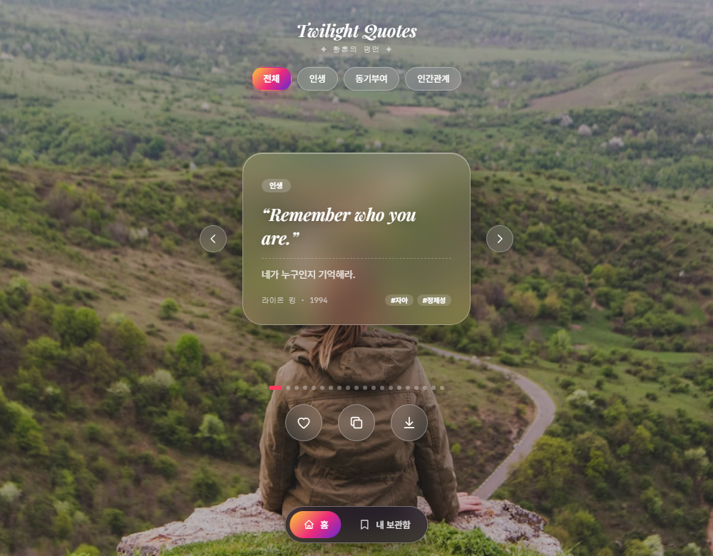
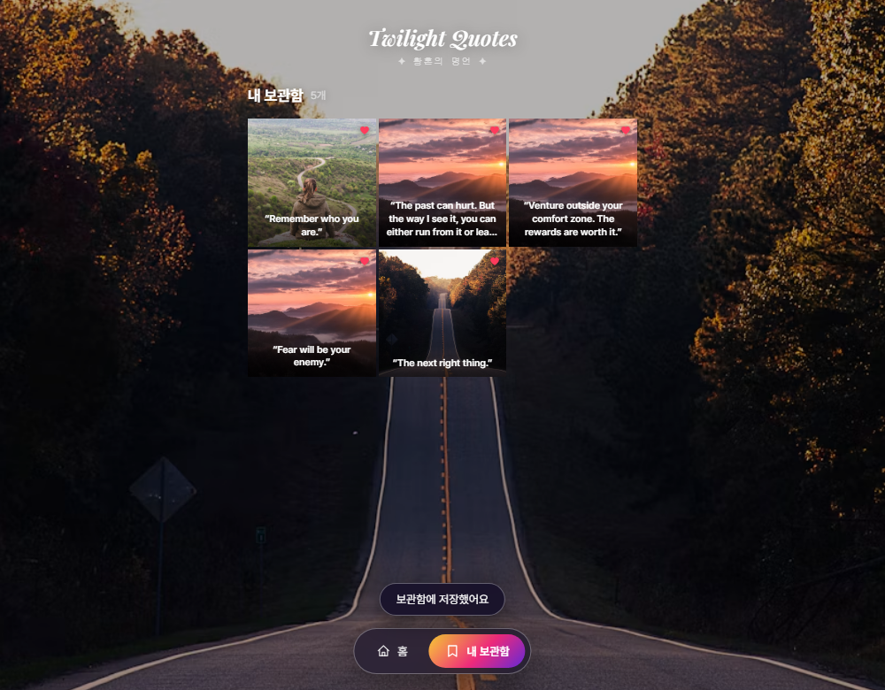

# Twilight Quotes · 황혼의 명언

디즈니 명대사 20개를 감상하는 인스타그램 감성의 글래스모피즘 명언 카드 앱입니다.
명언이 바뀔 때마다 Unsplash 배경 사진이 부드럽게 교차 전환되고, 마음에 드는 명언은 하트로 저장해 "내 보관함"에서 다시 볼 수 있습니다.

빌드 도구도, 프레임워크도, `npm install`도 없습니다 — `index.html`을 여는 순간 바로 실행됩니다.

<p align="center">
  
  
</p>

<p align="center">
  
  
  
  
</p>

## 주요 기능

| 기능 | 설명 |
|---|---|
| 카테고리 필터 | 전체 / 인생 / 동기부여 / 인간관계 — 20개 명언을 태그별로 걸러본다 |
| 동적 배경 | 명언이 바뀔 때마다 Unsplash 사진이 크로스페이드로 전환 (API 키 없이도 동작) |
| 좋아요 · 내 보관함 | 하트 버튼 또는 카드 더블탭으로 좋아요, `localStorage`에 저장되는 인스타그램 프로필 그리드 스타일 보관함 |
| 텍스트 복사 | 원문 · 번역 · 출처를 클립보드로 한 번에 복사 |
| 이미지로 저장 | 지금 보는 명언을 1080×1350 고화질 PNG 카드로 다운로드 (`html2canvas`) |
| 스와이프 내비게이션 | 좌우 스와이프 / 화살표 버튼 / 키보드 방향키로 카드 전환 |
| 라이트 · 다크 테마 | 화면 우측 상단 아이콘 버튼으로 설정 화면 이동 없이 즉시 테마 전환 |
| 다국어 지원 | 우측 상단 `EN/KO` 버튼으로 UI 문구, 카테고리, 명언, 출처, 태그를 한국어/영어로 전환 |
| 타이틀 홈 이동 | 상단 `Twilight Quotes` 타이틀을 클릭하면 언제든 홈 화면으로 이동 |

## 이번 작업 요약

2026년 9월 1일 작업에서는 상단 조작 흐름과 다국어 경험을 중심으로 앱을 개선했습니다.

- 우측 상단 테마 아이콘을 Settings 이동 버튼이 아닌 즉시 실행 토글 버튼으로 변경했습니다.
- Settings의 앱 테마 항목은 더 이상 필요하지 않도록 제거하고, 테마 상태를 `localStorage`에 저장해 새로고침 후에도 유지되게 했습니다.
- 우측 상단에 언어 변경 버튼을 추가해 한국어와 영어를 즉시 전환할 수 있게 했습니다.
- 명언 데이터 구조를 언어별 필드(`quoteKo`, `quoteEn`, `sourceKo`, `sourceEn`, `keywordsKo`, `keywordsEn`)로 정리했습니다.
- 카테고리 칩, 하단 내비게이션, 보관함, 토스트 메시지, 접근성 라벨까지 현재 언어를 따라가도록 반영했습니다.
- 화면 가운데 상단의 `Twilight Quotes` 타이틀을 홈 이동 버튼으로 변경했습니다.
- 기존 구현을 보존하기 위해 신규 구현 파일을 `*-v2.js`로 추가하고 `index.html`에서 최신 파일을 로드하도록 구성했습니다.

## 오류 수정 사항

- PowerShell 실행 정책 때문에 `npx.ps1`이 막히는 환경에서는 `npx.cmd`로 로컬 서버를 실행할 수 있도록 확인했습니다.
- 기존 일부 소스의 한글 문자열이 콘솔에서 깨져 보일 수 있어, 최신 기능에 필요한 UI/명언 데이터는 UTF-8 기준의 새 파일로 정리했습니다.
- 언어 전환 후 카드, 보관함, 카테고리 필터가 이전 언어로 남지 않도록 전체 렌더링 흐름을 갱신했습니다.
- 테마 전환 후 버튼 아이콘과 접근성 라벨이 현재 상태와 반대로 안내되도록 정리했습니다.
- 이미지 저장 시 현재 선택된 언어의 명언과 출처가 내보내기 템플릿에 반영되도록 수정했습니다.

## 빠른 시작

```bash
git clone https://github.com/oreum06/goorm-disney-quotes.git
cd goorm-disney-quotes
```

그리고 `index.html`을 브라우저로 더블클릭해서 열면 끝입니다. 로컬 서버로 확인하려면 아래 명령을 사용할 수 있습니다.

```bash
npx --yes serve . -l 5501
```

### Unsplash 배경을 실제 API로 연결하고 싶다면 (선택)

기본 상태로도 카테고리별로 미리 골라둔 사진이 배경으로 잘 나오지만, [Unsplash](https://unsplash.com/developers)에서 무료 Access Key를 발급받으면 매번 새로운 사진을 실시간으로 받아올 수 있습니다.

1. https://unsplash.com/developers 에서 회원가입 후 "New Application" 생성
2. 발급받은 Access Key를 `js/background.js` 상단의 `UNSPLASH_ACCESS_KEY`에 붙여넣기

```js
const UNSPLASH_ACCESS_KEY = "여기에_발급받은_키_붙여넣기";
```

## 프로젝트 구조

```
goorm-disney-quotes/
├── index.html              # 마크업 + 오프스크린 이미지-저장용 템플릿
├── css/
│   ├── style.css            # 글래스모피즘 + 배경 크로스페이드 스타일
│   └── theme-language.css   # 라이트/다크 테마 + 상단 언어/테마 버튼 스타일
├── js/
│   ├── data.js               # 명언 20개 데이터 (id/원문/번역/출처/카테고리 등)
│   ├── background.js         # Unsplash API 연동 + 대체 이미지 풀 + 배경 전환 로직
│   ├── render.js             # 데이터를 DOM으로 그리는 함수 모음
│   ├── app.js                # 상태 관리 + 이벤트 바인딩 (앱의 진입점)
│   ├── data-v2.js            # 한국어/영어 명언 데이터 + UI 번역 사전
│   ├── background-v2.js      # 최신 카테고리 키 기반 배경 전환 로직
│   ├── render-v2.js          # 언어 상태를 반영하는 카드/보관함 렌더러
│   └── app-v2.js             # 테마 토글, 언어 전환, 홈 타이틀 이동 로직
├── quotes.json               # data.js와 동일한 명언 데이터 (참고/외부 활용용)
├── docs/screenshots/         # 이 README에 쓰인 스크린샷
├── xref/                     # 원본 명언 목록·무드보드 레퍼런스 (앱 실행에는 사용되지 않음)
└── CLAUDE.md                 # 아키텍처 문서 + 작업 이력
```

파일 간 관계나 "왜 이렇게 만들었는지"가 궁금하다면 [`CLAUDE.md`](./CLAUDE.md)에 더 자세히 정리되어 있습니다.

## 기술 스택

순수 HTML5 · CSS3 · Vanilla JavaScript(ES6+)로만 만들었고, 외부 라이브러리는 CDN으로 딱 두 가지만 불러옵니다.

- [html2canvas](https://html2canvas.hertzen.com/) — "이미지로 저장하기" 기능에서 DOM을 PNG로 캡처
- [Pretendard](https://github.com/orioncactus/pretendard) / Playfair Display / JetBrains Mono — 웹폰트

## 명언 출처에 대하여

수록된 명대사는 디즈니·픽사 애니메이션의 대사를 짧게 인용한 것으로, 저작권은 각 작품의 저작권자(월트 디즈니 컴퍼니 등)에게 있습니다. 이 프로젝트는 비상업적 학습 목적의 팬 프로젝트입니다.
